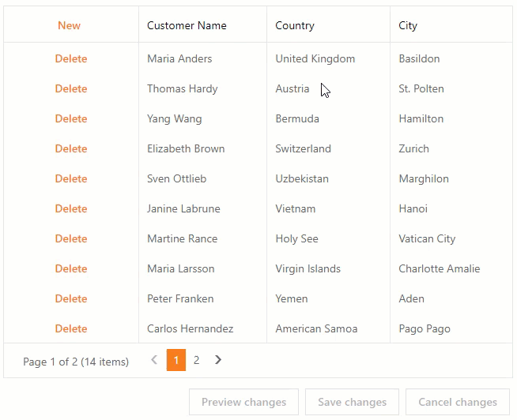

<!-- default badges list -->

[](https://supportcenter.devexpress.com/ticket/details/T124512)
[](https://docs.devexpress.com/GeneralInformation/403183)
<!-- default badges end -->
# ASPxGridView for ASP.NET Web Forms - Cascading Comboboxes in Batch Edit Mode
<!-- run online -->
**[[Run Online]](https://codecentral.devexpress.com/t124512/)**
<!-- run online end -->

This example demonstrates how to set up cascading combo boxes in [ASPxGridView](https://docs.devexpress.com/AspNet/DevExpress.Web.ASPxGridView) for use in the batch edit mode. In the example, the selection in the Country column's combo box editor filters the item list of the combo box in the City column. 



The cascading combo box implementation in batch edit mode is similar to the technique used in other cascading combo box implementations:  
**Respond to a selection change** of the first column's combo box editor (in its client [SelectedIndexChanged](https://docs.devexpress.com/AspNet/js-ASPxClientComboBox.SelectedIndexChanged) event) and **initiate a callback request** for the second column's combo box to **filter data source** items on the server (use a combination of the client-side [PerformCallback](https://docs.devexpress.com/AspNet/js-ASPxClientComboBox.PerformCallback(parameter)) method and server [Callback](https://docs.devexpress.com/AspNet/DevExpress.Web.ASPxCallback.Callback) event).

However, in batch edit mode, the grid uses a single instance of a column editor for all cells in this column. This instance does not perform a round trip to the server on each selection change. Because of that, you should manually update the items in the editors that depend on other editor's value (the second column's combo box editor). 

To update the items, handle the grid's client-side [BatchEditStartEditing](https://docs.devexpress.com/AspNet/DevExpress.Web.GridViewClientSideEvents.BatchEditStartEditing) event and call the second combo box's [PerformCallback](https://docs.devexpress.com/AspNet/js-ASPxClientComboBox.PerformCallback(parameter)) method with the selected country.


```js
function onBatchEditStartEditing(s, e) {
    currentRowIndex = e.visibleIndex;
    var currentCountry = s.batchEditApi.GetCellValue(currentRowIndex, "CountryId");

    if (currentCountry != lastEditedCountry && e.focusedColumn.fieldName == "CityId") {
        lastEditedCountry = currentCountry;
        e.cancel = true;
        cmbCity.PerformCallback(lastEditedCountry);
    }
}
```

## Setup the Grid its Column Editors
Create an [ASPxGridView](https://docs.devexpress.com/AspNet/DevExpress.Web.ASPxGridView), assign its data source, and set the grid's [Editing Mode](https://docs.devexpress.com/AspNet/DevExpress.Web.ASPxGridViewEditingSettings.Mode) to `Batch`. Add two columns of type [GridViewDataComboBoxColumn](https://docs.devexpress.com/AspNet/DevExpress.Web.GridViewDataComboBoxColumn) and set their data sources.

```xml
<dx:ASPxGridView ID="grid" ClientInstanceName="grid" runat="server" 
    DataSourceID="ObjectDataSourceCustomers"
    KeyFieldName="CustomerId" 
    ...
            
    <SettingsEditing Mode="Batch" />
                
        <dx:GridViewDataComboBoxColumn FieldName="CountryId" Caption="Country">
            <PropertiesComboBox 
                DataSourceID="CountriesDataSource"
                TextField="CountryName" 
                ValueField="CountryId">
                ...
            </PropertiesComboBox>
        </dx:GridViewDataComboBoxColumn>
                
        <dx:GridViewDataComboBoxColumn FieldName="CityId" Caption="City">
            <PropertiesComboBox ClientInstanceName="cmbCity"
                DataSourceID="CitiesDataSource"
                TextField="CityName" 
                ValueField="CityId" 
                ValueType="System.Int32">
            </PropertiesComboBox>
            ...
        </dx:GridViewDataComboBoxColumn>
    </Columns>
</dx:ASPxGridView>

<asp:SqlDataSource ID="CountriesDataSource" runat="server" ... />
<asp:SqlDataSource ID="CitiesDataSource" runat="server" ... />

<asp:ObjectDataSource ID="ObjectDataSourceCustomers" runat="server" ... />
```

## On Client: Respond to a Selection Change and Initiate a Callback
Handle the [SelectedIndexChanged](https://docs.devexpress.com/AspNet/js-ASPxClientComboBox.SelectedIndexChanged) event of the first column's combo box editor. In the event handler, call the client-side [PerformCallback](https://docs.devexpress.com/AspNet/js-ASPxClientComboBox.PerformCallback(parameter)) method of the second column's combo box editor. This sends a callback to the server for the second editor to filter its item list. In the [PerformCallback](https://docs.devexpress.com/AspNet/js-ASPxClientComboBox.PerformCallback(parameter)) method's parameter, pass the first combo box's selected value to use it as a filter criterion on the server.

```xml
<dx:ASPxGridView ID="grid" ClientInstanceName="grid" runat="server" ...
        ...
        <dx:GridViewDataComboBoxColumn FieldName="CountryId" Caption="Country">
            <PropertiesComboBox 
                ...
                <ClientSideEvents SelectedIndexChanged="onSelectedCountryChanged" />
```

```js
function onSelectedCountryChanged(s, e) {
    lastEditedCountry = s.GetValue();
    grid.batchEditApi.SetCellValue(currentRowIndex, "CityId", null);
    cmbCity.PerformCallback(s.GetValue());
}
```

The column's combo box editor instance is created at runtime. Because of that, you should use the grid's server-side [CellEditorInitialize](https://docs.devexpress.com/AspNet/DevExpress.Web.ASPxGridView.CellEditorInitialize) event handler to access the column's editor instance and set its [Callback](https://docs.devexpress.com/AspNet/DevExpress.Web.ASPxCallback.Callback) event handler.

```xml
<dx:ASPxGridView ID="grid" ClientInstanceName="grid" runat="server" ...
    OnCellEditorInitialize="grid_CellEditorInitialize"...
    ...
```

```c#
protected void grid_CellEditorInitialize(object sender, ASPxGridViewEditorEventArgs e) {
    ASPxGridView gridView = sender as ASPxGridView;

    if (e.Column.FieldName == "CityId") {
        ASPxComboBox cmbCity = (e.Editor as ASPxComboBox);
        cmbCity.Callback += cmbCity_OnCallback;
    }
}
```

## On Server: Filter Data Source Items
Handle the second combo box column's server-side [Callback](https://docs.devexpress.com/AspNet/DevExpress.Web.ASPxCallback.Callback) event that fires in response to a call to the client-side [PerformCallback](https://docs.devexpress.com/AspNet/js-ASPxClientComboBox.PerformCallback(parameter)) method. In the handler, use the event argument's [Parameter](https://docs.devexpress.com/AspNet/DevExpress.Web.CallbackEventArgsBase.Parameter) property to obtain the first combo box column's selected value passed from the client side. Use this value to filter the second combo box column's data source.

```c#
void cmbCity_OnCallback(object source, CallbackEventArgsBase e) {
    FillCityCombo(source as ASPxComboBox, e.Parameter);
}

protected void FillCityCombo(ASPxComboBox cmb, string country) {
    // Reset the City combo box column.
    cmb.DataSourceID = null;
    cmb.Items.Clear();

    if (!string.IsNullOrEmpty(country)) {
        // Get the list of cities from the data source, filter it with the passed parameter, and fill the combo box with filtered items.
        cmb.DataSource = WorldCitiesDataProvider.GetCities()
                                                .Where(c => c.CountryId == Convert.ToInt32(country))
                                                .OrderBy(c => c.CityName)
                                                .GroupBy(c => c.CityName)
                                                .Select(g => g.FirstOrDefault())
                                                .ToList();

                cmb.DataBindItems();
            }
        }
```

## Documentation
- [ASPxGridView](https://docs.devexpress.com/AspNet/DevExpress.Web.ASPxGridView)
- [SelectedIndexChanged](https://docs.devexpress.com/AspNet/js-ASPxClientComboBox.SelectedIndexChanged)
- [PerformCallback](https://docs.devexpress.com/AspNet/js-ASPxClientComboBox.PerformCallback(parameter)) 
- [Callback](https://docs.devexpress.com/AspNet/DevExpress.Web.ASPxCallback.Callback)
- [BatchEditStartEditing](https://docs.devexpress.com/AspNet/DevExpress.Web.GridViewClientSideEvents.BatchEditStartEditing)

## Files to Look At
- [Default.aspx](./CS/CascadingComboBoxesBatch/Default.aspx) (VB: [Default.aspx](./VB//CascadingComboBoxesBatch//Default.aspx))
- [Default.aspx.cs](./CS//CascadingComboBoxesBatch//Default.aspx.cs) (VB: [Default.aspx.vb](./VB//CascadingComboBoxesBatch//Default.aspx.vb))

## More Examples
- [Cascading Editors (Batch Editing) Demo](https://demos.devexpress.com/ASPxGridViewDemos/GridEditing/CascadingComboBoxesBatch.aspx)
- [GridView for ASP.NET MVC- A simple implementation of cascading comboboxes in Batch Edit mode](https://github.com/DevExpress-Examples/gridview-a-simple-implementation-of-cascading-comboboxes-in-batch-edit-mode-t155879)
- [ASPxGridView - How to implement cascading combo boxes in Batch Edit mode by using WebMethods](https://github.com/DevExpress-Examples/aspxgridview-how-to-implement-cascading-combo-boxes-in-batch-edit-mode-by-using-webmethods-t356740)

